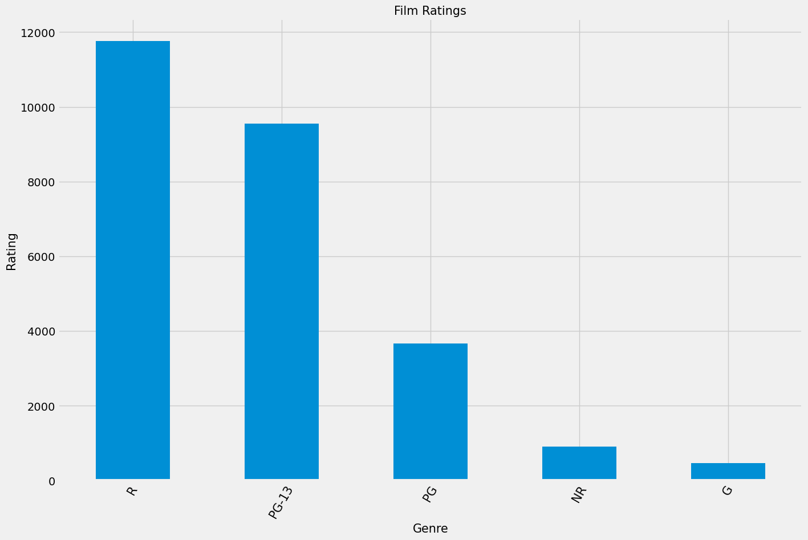
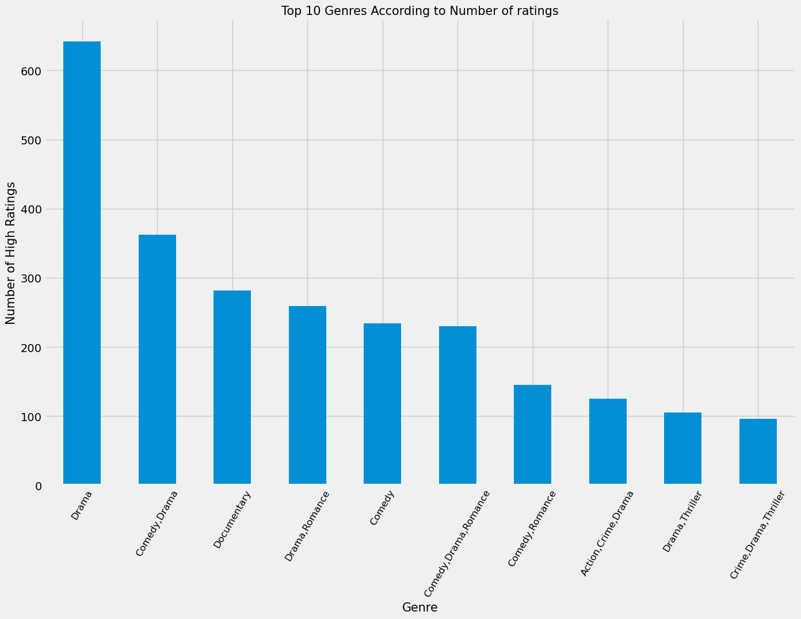
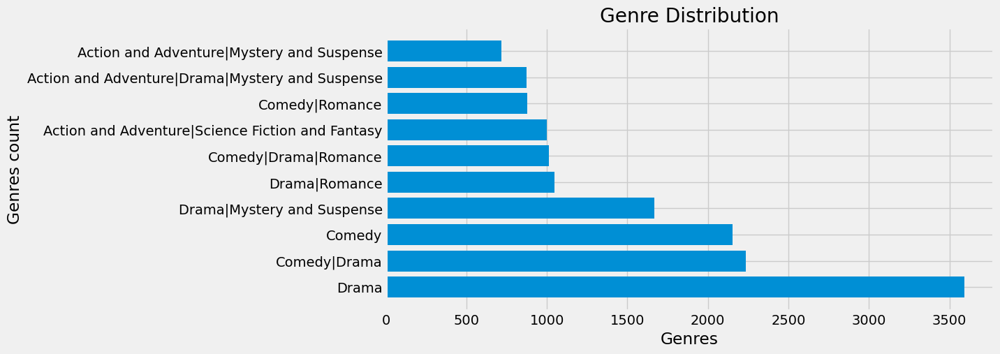

## MOVIE ANALYSIS

#### Overview
For this project, it will provide data analysis to generate insights on how new stakeholders can develop
ideas and make informed investments in the movie business:

#### Business Problem
Microsoft sees all the big companies creating original video content and they want to get in on the fun.
They have decided to create a new movie studio, but they don’t know anything about creating movies.
You are charged with exploring what types of films are currently doing the best at the box office. You
must then translate those findings into actionable insights that the head of Microsoft&#39;s new movie
studio can use to help decide what type of films to create.
the following steps should be considered before investing in a movie they will be as a follows:

- consider the ratings of a movie genre
- Which genre has the most votes
- Number of votes of a movie

The Data
Data to be used will be from:
- [Box Office Mojo](https://www.boxofficemojo.com/)
- [IMDB](https://www.imdb.com/)
- [Rotten Tomatoes](https://www.rottentomatoes.com/)
- [TheMovieDB](https://www.themoviedb.org/)
- [The Numbers](https://www.the-numbers.com/)

The MovieDB is a database.This is the ERD:

### Results
- This shows That The most rated genres are of type R rating then PG-13

- This shows the top 10 most rated movie genres

- This shows the most popular movie genres

### Conclusion

This analysis has been able to provide answere that can lead to actionaable recommendations. From this findings the most popular movie genres are Drama, Comedy, Comedy Drama,R rated movies has been found the most popular, The genres which are  most rated are Drama,Comedy and Documentary

### Recommendations 
1.I will recommend Microsoft to start producing movies based on    genres are Drama, Drama|Comedy and Documentary

2.I will recommend Microsft to start producing movies that are      R-rated and the PG-13 movies.Beacause they are the most popular

3. The most Popular movie genres are Drama, Comedy|Drama and Comedy
   focusing on this genres is likely to make microsoft successful
